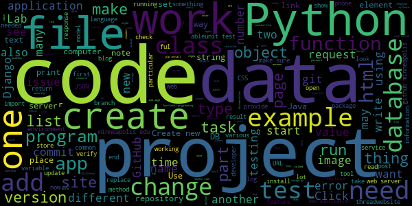

### The words I wrote most in 2017's Software Development class.

How'd Java get in there?? 

Started with a zip export file of everything from D2L, which contains XML, HTML and PPTX files. Various Python modules helpful for extracting text from different document formats, see requirements.txt. 
